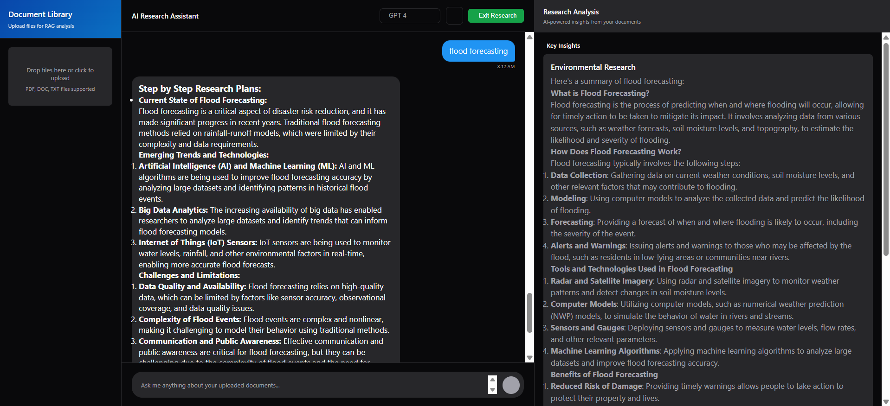

# 🧠 RAG-Based Researcher

A smart research assistant built with **LangChain** and **LangGraph** that reads your **PDF documents**, understands your **questions**, and conducts **contextual research**.

---

## 📌 Features

- ✅ Accepts PDF documents for document-grounded research.
- 🧾 Automatically detects if the query relates to uploaded PDFs.
- 💬 Handles general queries even if not document-related.
- 🧭 Asks for clarification when user queries are ambiguous.
- 🚫 Applies **hallucination checks** to ensure grounded answers.
- 🧠 Built with **LangGraph** (multi-agent orchestration) and **LangChain** for retrieval and reasoning.

---

## 🖼️ Project Screenshot

> _Add your screenshot here_



---

## 🧪 Example Use Cases

- Research scientific articles
- Summarize regulatory or legal documents
- Answer domain-specific questions from technical PDFs
- Provide fallback general knowledge responses
- Prompt user if clarification is required

---

## 🛠️ Setup Instructions (with `uv`)

### 1. Clone the repository

```bash
git clone git@github.com:AnuzThapa/RAG-Based-Researcher.git
cd RAG-Based-Researcher

uv venv
source .venv/bin/activate   # On Windows: .venv\Scripts\activate
uv sync or uv pip install -r requirements.txt

uv pip install -e .
```

## Start the FastAPI backend:
```bash
uvicorn app.main:app --reload
```
## Start the frontend (React/Vite):
```bash
cd frontend
npm install
npm run dev
```
